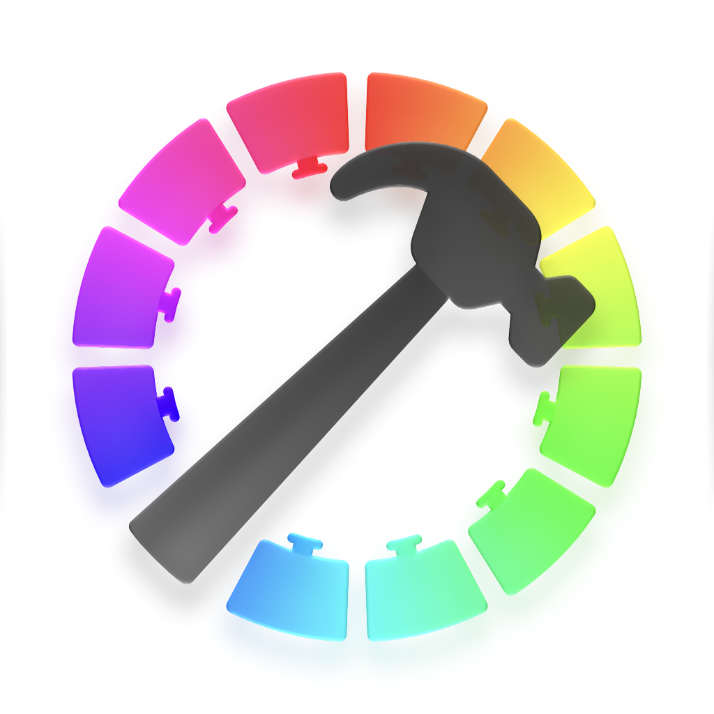

<p align="center">
  <picture>
    <source media="(prefers-color-scheme: dark)" srcset="res/app-icon-Dark-1024@1x.png">
    
  </picture>
</p>

# WebGLScreenSaver
A native macOS application that turns WebGL / GLSL shaders into interactive screen savers.
> [!WARNING]
> This project is currently **experimental**.

---

## Installation
Install via [Homebrew](https://brew.sh/):
```bash
brew install --cask Harumaru169/tap/webgl-screen-saver
```

## Building and Installation

### Prerequisites
- Xcode 27 or later (or compatible version)
- macOS 26.0 or later

### Build with Xcode
1. Clone the repository:
   ```bash
   git clone https://github.com/Harumaru169/WebGLScreenSaver.git
   cd WebGLScreenSaver
   ```
2. Open the project in Xcode:
   ```bash
   open WebGLScreenSaver.xcodeproj
   ```
3. Set your **Signing Team** under **Signing & Capabilities** for both `WebGLScreenSaver` and `WebGLScreenSaverExtension` targets.
4. Build and run (⌘R) the host app.
### Extension Registration
macOS usually detects newly built screen saver extensions automatically. If it does not appear under **System Settings → Screen Saver**:
1. Click **Install** within the host application, or register manually via `pluginkit`:
   ```bash
   pluginkit -a ~/Library/Developer/Xcode/DerivedData/WebGLScreenSaver-*/Build/Products/Debug/WebGLScreenSaver.app/Contents/PlugIns/WebGLScreenSaverExtension.appex
   ```
2. If macOS serves a cached version after rebuilding, restart `WallpaperAgent`:
   ```bash
   killall WallpaperAgent
   ```
> [!TIP]
> Keep builds in a single location on your machine (either Xcode's `DerivedData` or `/Applications/`) to prevent `pluginkit` caching conflicts.

## Logs via Console.app

Both the host app and the screen saver extension log to a unified subsystem.
- **Console.app**: Filter by subsystem `kosei.haruyama.WebGLScreenSaver`
- **Terminal**:
  ```bash
  log stream --predicate 'subsystem == "kosei.haruyama.WebGLScreenSaver"' --level debug
  ```

## Acknowledgements

This project is built upon the foundation of [ScreenSaverMinimal](https://github.com/AerialScreensaver/ScreenSaverMinimal) by Guillaume Louel and the AerialScreensaver contributors. 

## License

[MIT](LICENSE)
